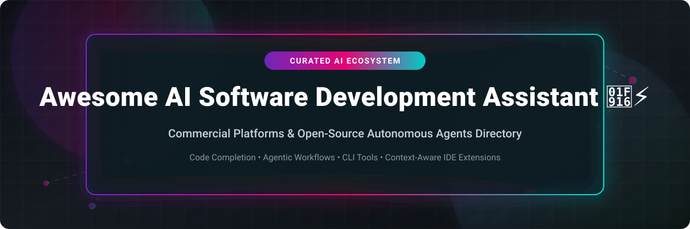

# Awesome-AI-Software-Development-Assistant 🤖⚡💻

  

  
  
  
  
  
  

---

## 🌟 Top AI Software Development Assistant Ecosystem 🚀

**Curated Directory of Commercial AI Coding Tools, Autonomous Dev Agents, CLI Pair Programmers & Open-Source Agent Frameworks** 🧠

*Empowering developers with repository-aware context, agentic refactoring, self-hosted LLM integration, and automated code generation.* ⚡

**Last updated: October 2026** 📅

---

### 📌 Overview & SEO Summary 🔍

Welcome to the definitive, high-ranking index of **AI software development assistants**, **autonomous coding agents**, **IDE extensions**, and **terminal-based developer tools**. Modern software engineering is evolving from passive autocomplete to fully autonomous agentic workflows. 

Whether you are looking for enterprise-grade commercial platforms (*GitHub Copilot*, *Cursor*, *Windsurf*, *Amazon Q Developer*, *Replit AI*), or powerful self-hostable open-source alternatives (*AutoGPT*, *OpenHands*, *GPT Pilot*, *Cline*, *Aider*, *Continue*, *Goose*), this repository provides an up-to-date breakdown of model support, pricing tiers, star ratings, and licensing. 

#### 🔑 Key Categories Covered:
- 🤖 **Autonomous Coding Agents:** Multi-step reasoning agents that clone repos, run tests, fix bugs, and execute terminal commands.
- ⌨️ **AI Code Completion & Chat IDEs:** High-speed inline tab completions and codebase-aware multi-file editing.
- 🖥️ **CLI & Terminal Assistants:** Lightweight command-line pair programmers powered by local (Ollama/LM Studio) or cloud models.
- 🧪 **AI Code Integrity & Automated PR Review:** Automated testing, security auditing, and code review agents.

---

## 📑 Table of Contents 📜

- [🏢 SaaS & Commercial Platforms](#-saas--commercial-platforms)
- [🔓 Open-Source GitHub Projects](#-open-source-github-projects)
- [🛠️ How to Contribute](#%EF%B8%8F-how-to-contribute)
- [🤝 Support & Sponsorship](#-support--sponsorship)
- [📊 Star History](#-star-history)
- [⚠️ Disclaimer](#%EF%B8%8F-disclaimer)

---

## 🏢 SaaS / Commercial Platforms 💼

The global AI coding assistant market size is estimated at **~$7.2 Billion in 2026** (projected to reach **$28+ Billion by 2030**). The sector is **moderately fragmented**, experiencing a transitional phase where hyper-funded challengers (Cursor/Anysphere, Cognition/Windsurf) compete heavily against consolidated tech titans (Microsoft GitHub Copilot, Amazon Q Developer).

| SaaS / Commercial Platform | Company / Owner | Valuation / Market Cap | Standard Edition Starting Price | Free Tier / Free Trial Limits | Description |
| :--- | :--- | :--- | :--- | :--- | :--- |
| **[GitHub Copilot](https://github.com/features/copilot)** 🤖 | Microsoft / GitHub | ~$3.90 Trillion | $10/mo (Pro Plan) | Free plan (2,000 completions/mo + 50 chat messages/mo) & 30-day Pro trial | **The most widely adopted AI coding assistant** — Code completions unlimited on paid plans. Pro includes $15 total usage ($10 base + $5 flex), Pro+ includes $70 ($39 + $31), Max includes $200 ($100 + $100). |
| **[Amazon Q Developer](https://aws.amazon.com/q/developer/)** ☁️ | Amazon | ~$2.0 Trillion | $19/user/mo (Pro Tier) | Free Tier (50 agentic requests/mo, 1,000 chat messages/mo) | **AWS's AI coding assistant** — Agentic terminal chat for building, debugging, and DevOps. Deep AWS service integration. |
| **[Cursor](https://cursor.com/)** 🖱️ | Anysphere (SpaceX) | ~$60.0 Billion | $20/mo (Pro Tier) | Hobby Free Plan (2,000 completions/mo + 50 slow agent requests/mo) & 14-day Pro trial | **AI-native code editor (VS Code fork)** — $20 Pro includes $20 of frontier-model usage. Auto mode is effectively unlimited and doesn't drain credits. Teams: $40/user/month. |
| **[Replit AI](https://replit.com/ai)** 🔧 | Replit | ~$9.0 Billion | $20/mo (Core Plan) | Starter Free Plan (10 AI Agent runs/mo + basic workspace) | **Browser-based development with AI Agent** — Core includes $20 monthly credits. Pro adds 10 parallel Agent tasks, credit rollover for 2 months. |
| **[Sourcegraph Cody](https://sourcegraph.com/cody)** 🔍 | Sourcegraph | ~$2.6 Billion | $9/mo (Pro Tier) | Free Plan (200 chats/mo + unlimited autocomplete) | **Codebase-aware AI assistant** — Uses Sourcegraph's code graph for context across massive repositories. |
| **[JetBrains AI Assistant](https://www.jetbrains.com/ai/)** 🧠 | JetBrains | ~$2.5 Billion (~$650M Revenue) | $10/mo (AI Pro Tier) | 7-day Free Trial with 50 AI Credits | **Native IDE integration** — Each AI Credit ≈ $1 USD. ~40 code generations in editor per credit. Configurable to use third-party models. |
| **[Qodo (formerly CodiumAI)](https://www.qodo.ai/)** 🧪 | Qodo | ~$500 Million (Series B) | $19/dev/mo (Teams Tier) | Developer Free Plan (up to 75 PR reviews/mo + basic code analysis) | **AI code review and test generation** — Focused on code integrity rather than completion. Multi-agent PR review architecture. |
| **[Windsurf](https://windsurf.com/)** 🏄 | Cognition AI | ~$250 Million | $15/mo (Pro Tier) | Free Plan (25 prompt credits/mo + unlimited tab autocompletions) | **Agentic IDE (VS Code fork)** — Ranked #1 in LogRocket AI Dev Tool Power Rankings (Feb 2026). Daily/weekly quotas, Tab autocomplete unlimited on all plans. |
| **[Codeium](https://codeium.com/)** (Windsurf) | Codeium / Cognition | ~$250 Million | $15/mo (Consolidated under Windsurf Pro) | Windsurf Free Plan (25 prompt credits/mo) | **AI coding assistant** — Originally a free Copilot alternative, now consolidated into Windsurf. |
| **[Tabnine](https://www.tabnine.com/)** 💡 | Tabnine (Tricentis) | ~$100 Million | $12/user/mo (Dev Plan) | Starter Free Plan (Basic single-line autocomplete) & 14-day Pro trial | **AI code assistant** — Code completion, chat, and enterprise deployment with VPC/on-prem options. Privacy-first architecture. |

---

## 🔓 Open-Source GitHub Projects 🌐

*Sorted strictly by GitHub Stars_Count (Descending)* 🌟

- **[AutoGPT](https://github.com/Significant-Gravitas/AutoGPT)**   
  **The vision of accessible AI for everyone**, MIT licensed. ~185k+ stars. Pioneer of autonomous AI agent loops, task breakdown, and custom agentic coding capabilities. 🤖

- **[OpenHands](https://github.com/All-Hands-AI/OpenHands)**   
  **Open-source platform for software development agents**, MIT licensed. ~90k+ stars. Agents that modify code, run bash commands, browse docs, and execute complex developer tasks. 🖐️

- **[GPT Pilot](https://github.com/Pythagora-io/gpt-pilot)**   
  **AI developer that builds apps from scratch with human oversight**, MIT licensed. ~33k+ stars. Writes full-stack code step-by-step, asks clarifying questions, and fixes terminal errors dynamically. 🛫

- **[Cline (formerly Claude Dev)](https://github.com/cline/cline)**   
  **Autonomous coding agent extension for VS Code**, Apache-2.0 licensed. ~30k+ stars. Edits files, executes terminal commands, opens browsers, and supports OpenRouter, Claude, Gemini, and Ollama. 📎

- **[Aider](https://github.com/Aider-AI/aider)**   
  **AI pair programming in your terminal**, Apache-2.0 licensed. ~25k+ stars. Maps codebase repository context, performs multi-file edits, and automatically commits clean Git messages. 🖥️

- **[Continue](https://github.com/continuedev/continue)**   
  **Open-source IDE extensions for custom AI coding**, Apache-2.0 licensed. ~20k+ stars. Integrates LLMs into VS Code & JetBrains with custom autocomplete, chat sidebars, and local model bindings. 🔌

- **[Devika](https://github.com/stitionai/devika)**   
  **Open-Source AI Software Engineer**, MIT licensed. ~19.6k stars. Understands high-level human instructions, breaks them into tasks, researches documentation, and writes code. 👩‍💻

- **[Goose](https://github.com/block/goose)**   
  **Extensible open-source AI agent for developer automation**, Apache-2.0 licensed. By Block (Square). Runs locally on your machine, automating code edits, research, and shell scripts. 🦢

- **[OpenCode](https://github.com/sst/opencode)**   
  **Terminal-first client/server AI coding agent**, MIT licensed. Built for speed, supports local and remote frontier models with rich TUI interfaces. 🔓

- **[Melty](https://github.com/meltylabs/melty)**   
  **The open-source AI code editor that reads your mind**, MIT licensed. ~5.4k stars. Deep Git awareness, tracking every keystroke and commit with full AI context synchronization. 🍦

- **[Letta Code](https://github.com/letta-ai/letta)**   
  **Memory-first CLI coding agent**, Apache-2.0 licensed. ~3.5k stars. Persistent state memory across developer sessions, learning skills and codebase rules over time. 🧠

- **[Devon](https://github.com/entropy-research/Devon)**   
  **Open-source pair programmer with TUI interface**, MIT licensed. ~3.5k stars. Autonomous plan-execute-debug pipeline for complex software repositories. 👨‍💻

- **[AutoCodeRover](https://github.com/nus-apr/auto-code-rover)**   
  **Autonomous program improvement agent**, Apache-2.0 licensed. ~3.1k stars. Combines LLMs with program analysis to resolve real GitHub issues automatically. 🔧

- **[Tau](https://github.com/taubyte/tau)**   
  **Readable Python CLI agent harness**, MIT licensed. ~2.9k stars. Lightweight session branching, MCP tool extensions, and teaching framework for agent engineering. 🐍

- **[Nanocoder](https://github.com/Nano-Collective/nanocoder)**   
  **Local-first CLI coding agent**, MIT licensed. ~2.5k stars. Works with Ollama, OpenRouter, and OpenAI APIs with native tool calling and custom file tools. 🧬

- **[RA.Aid](https://github.com/ai-christianson/RA.Aid)**   
  **Autonomous coding agent built on LangGraph**, MIT licensed. ~2.2k stars. Features a research, planning, and execution multi-agent loop with optional Aider integration. 🧪

- **[Maki](https://github.com/maki-ai/maki)**   
  **Rust TUI coding agent for context-token efficiency**, MIT licensed. ~1.1k stars. Tree-sitter file indexing, sandboxed code execution, and MCP standard support. 🦀

- **[VT Code](https://github.com/vinhnx/vtcode)**   
  **Open-source CLI coding agent with LLM-native context**, MIT licensed. ~857 stars. Features shell safety gates and automatic multi-provider failover. 🛡️

---

## 🛠️ How to Contribute 🤝

Contributions are welcome and greatly appreciated! Help us keep this directory the most comprehensive resource for AI developer tools:

1. 🍴 **Fork** this repository.
2. 📝 **Add or update** entries in `README.md` following the existing format.
3. 🔗 Include project title, official website/GitHub link, exact Stars_Count, license, and brief description.
4. 🚀 Submit a **Pull Request** with a concise description of your additions.

---

## 🤝 Support & Sponsorship ❤️

If you find this AI software development assistant repository useful, please consider supporting the project:

- ⭐ **Star** this repository to help others discover it!
- 🔀 **Fork** and share with fellow developers, AI engineers, and open-source contributors.
- ☕ **Sponsor & Buy Me a Coffee**: Support ongoing open-source curation via the [GitHub Sponsor Dashboard](https://github.com/sponsors/ishandutta2007).

---

## 📊 Star History 📈

---

## ⚠️ Disclaimer 🔒

- This list is **community-curated** for informational purposes and does not constitute an endorsement. ℹ️
- AI coding assistants and autonomous agents can generate incorrect, buggy, or vulnerable code. **Always review and test code** before pushing to production. 🛡️
- Open-source agent frameworks afford complete data privacy and model customization, while commercial SaaS platforms offer turnkey SLA support and team management. 🤖

---

  <b>Made with ❤️ for developers, AI engineers, and open-source coding agent builders.</b>

